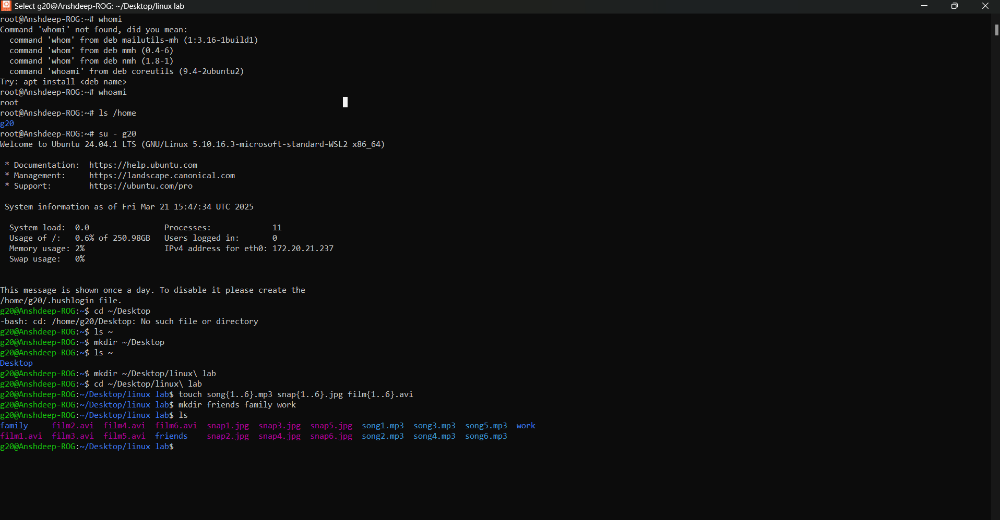

<h1>
  Experiment
</h1>

<h3>
  1. Use the touch command to create sets of empty practice files to use during this lab. In each set, replace X with the numbers 1 through 6. Create six files with names of the form songX.mp3, snapX.jpg, filmX.avi. 
    
  2. Create three subdirectories for organizing your files, and name the subdirectories friends, family, and work. Use a single command to create all three subdirectories at the same time.
</h3>

<h1>
  Solution
</h1>

<h4>
  Lab 01:
</h4>
<b> 1.</b> Select the folder and type the command:
 <i>touch song.{1..6}.mp3 , snap{1..6}.jpg , film{1..6}.avi <i>

<b>2.</b> Use the ls command to check that the files has been made in the present working directory.
<h4>
  Lab 02:
</h4>
1. In the same folder, type
     <i>mkdir friends family work</i>

