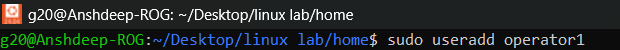
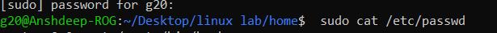
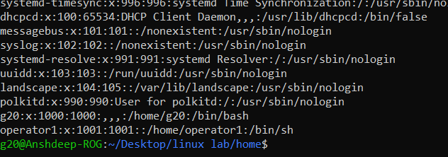
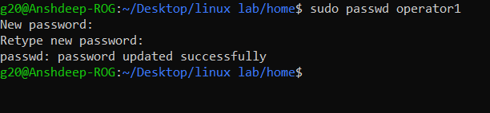
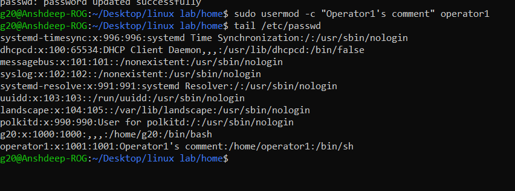
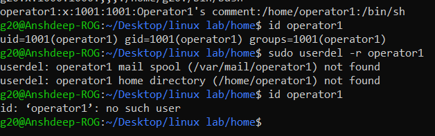

<h1>
  🚀 Experiment 11 - 12 🚀
</h1>

<h3>
  1. Create the operator1 user and confirm that it exists in the system. Set the password for operator1. Create the additional operator2 and operator3 users. Set theirpasswords as well. 
      
  2. Run the usermod -c command to update the comments of the operator1 user account. Remove the operator3 user from the system.
</h3>

<h1>
  Solution : 
</h1>

<h5>
  Lab 11: </h5>

  1. Open the terminal and type:
     <i>
       sudo useradd operator1
     </i>

     

  2. To check whether or not the user is added or not :
     <i>
       sudo cat /etc/passwd
     </i>
     

     --> At the end of the file, you will be able to see:
       

  3. To add the password:
      <i>
      sudo passwd operator1
     </i>
 

     <h5>
       Lab 12:
     </h5>
     1. To add the comments on a particular user, type:  
     <i>sudo usermod -c "Operator1's comment" operator1</i>
     
     

    2. To delete the user... <i>sudo userdel -r operator</i> 
    
  
---
     