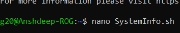
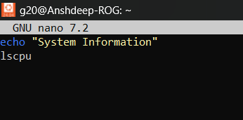
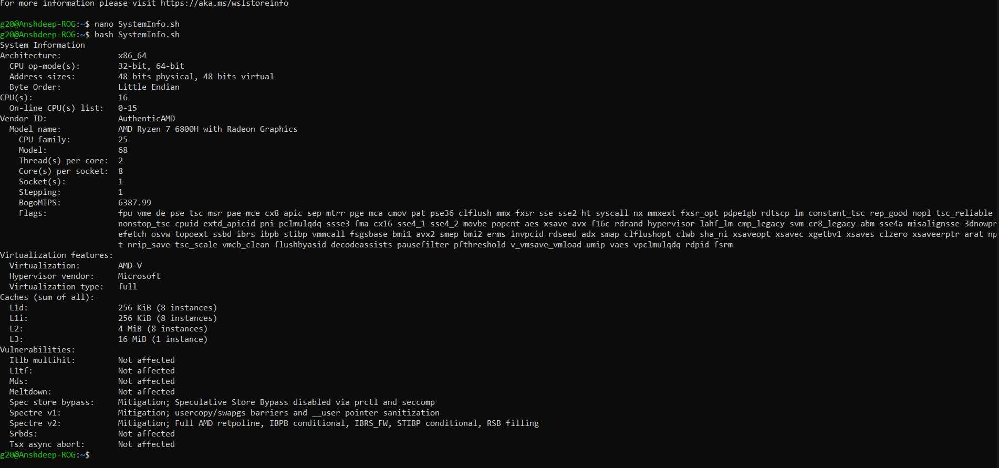
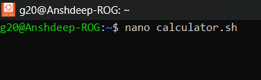
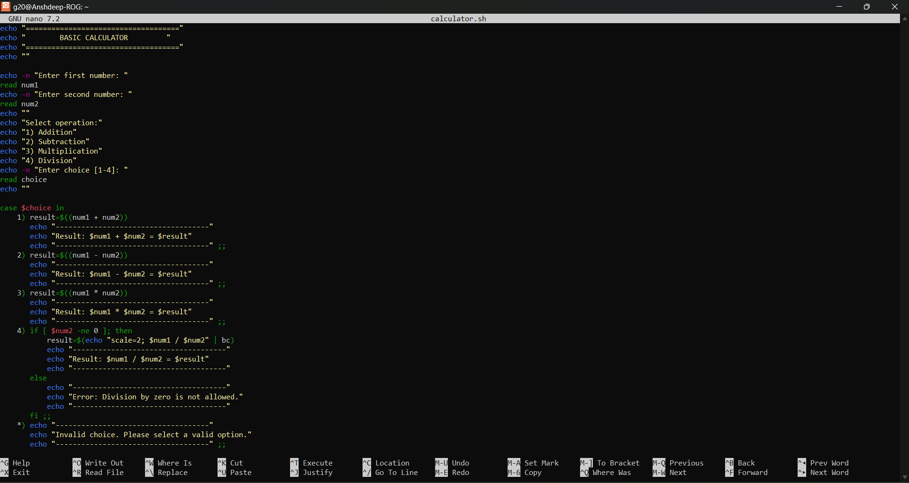
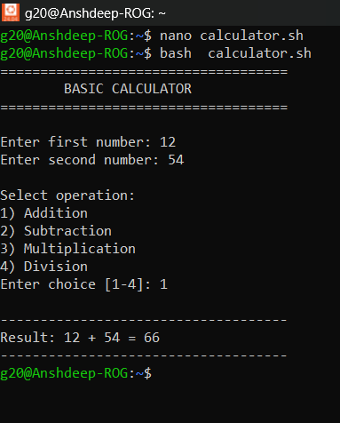
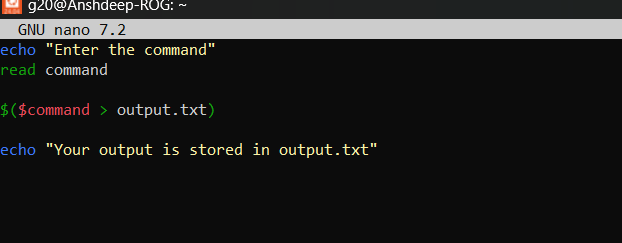
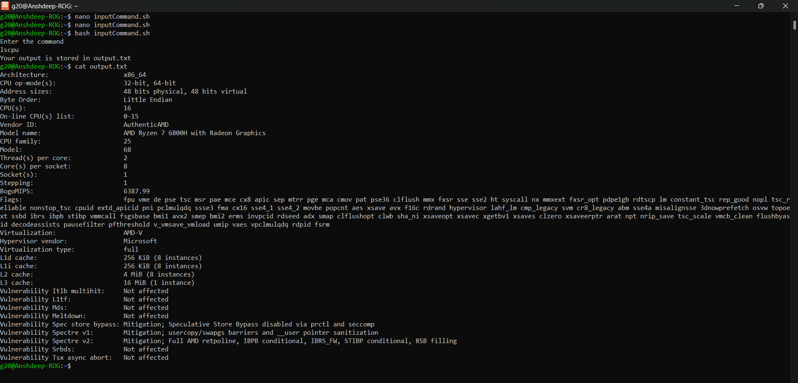

<h1>
  🚀 Experiment 15-16 🚀
</h1>

<h3>
  1. Write shell scripts to print system information.   
  2. Write shell script to perform basic mathematical calculation.   
  3. Use redirection operators to store the output of commands. 
</h3>

<h1>
  Solution :
</h1>

<h5>
  1) 
</h5>
  1. Open the terminal and type : 
  <i>
    nano SystemInfo.sh
  </i>
  
  

  2. Within the editor type
     

  3. The following will be the output:
    

<h5>
  2)
</h5>

  1. Open the terminal and type :
     <i>
       nano calculator.sh
     </i>
    

  2. Within the terminal type the following code :

     

3. Save the file by pressing Ctrl+x, Y and Enter
     

  

  <h5>
    3)
  </h5>

  1. Open the terminal and type :
     <i>nano inputCommand.sh</i>
     
     

  2. Within the terminal type :
     

  3. Save it and run :
     

     