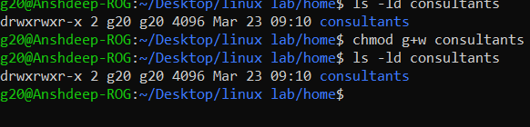

<h1>
  🚀 Experiment 07 - 08 🚀
</h1>

<h3>
01. Create the /home/consultants directory. Add write permission to the consultants group. Use the symbolic method for setting the appropriate permissions. 
    
02. Forbid others from accessing files in the /home/consultants directory. Use the octal method for setting the appropriate permissions. Change the default umask for the operator1 user. The new umask prohibits all access for users that are not in their
group. Confirm that the umask is changed.
</h3>

<h1> Solutions </h1>

<h5>
  Lab 07:
</h5>
&nbsp;01. Create a Directory home by using the command  <i>mkdir home</i>

 

&nbsp; 02. Create another directory <i>consultants</i> in home by

 <i> cd home   mkdir constultants </i> 

 

&nbsp; 03. For giving permissions to the consultants group : 
  <i> ls -ld consultants </i> for checking the initial permissions
  <i> chmod g+w consultants </i>

 

<h5>
  Lab 08: 
</h5>

&nbsp; 01. Type chmod 750 consultants for forbidding others from accessing the files. 7 for users, 5 for groups and 0 for others

 

02. Check the exisiting umask, by typing <i>umask</i>

03. Change the umask to 0066 so as to prohibit the group from all the permissions.
04. Then check the permission by <i>ls- l</i>  
 

