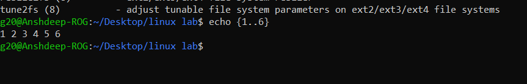

<h1>
  🚀 Experiment 03 - 04 🚀
</h1>

<h3>
1. View the gedit man page. Use the man -k ext4 command to find the command to tune ext4 file-system parameters.
    
2. Brace expansion is used to generate discretionary strings of characters. Braces contain a comma-separated list of strings,  or a sequence expression. The result includes the text that  precedes or follows the brace definition
</h3>

<h1>
  Solutions
</h1>

<h5>
  Lab 03:
</h5>

1. To view the man gedit page, type in the terminal
   <i>
     man gedit
   </i>
  
   Following window will appear:

   
2. Press <i> 'q' </i> to exit .Now type,
    <i>
  man -k ext4
   </i>
   
    
   This is the desired result

<h5>
  Lab 04: 
</h5>

<h6>
  Brace Expansion Example : 
</h6>

  Open the terminal and type :
   <i>echo {1..6}</i>
    
   Also you can try: {start..stop..step}
   for example : <i> echo {z..a..-1} </i>
    

