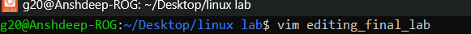

<h1>
  🚀 Experiment 05 - 06 🚀
</h1>

<h3>
1. Use Vim,nano, to edit the editing_final_lab.txt file. Use the lab_file shell variable. Enter the visual mode of Vim.
    
2. Remove the last seven characters from the first column on the first line. Preserve only the first four characters of the first column
</h3>

<h1> Solutions </h1>

<h5>
  Lab 05:
</h5>
1. Enter the Visual Mode of Vim by typing:   <i>vim editing_final_lab  

 

</i>

The following window will appear

<h5>
Lab 06: 
</h5>

1. Enter some content in the file by pressing <i> i </i>

2. Remove the last 7 characters of the file. 

!

3. Now save and exit by pressing <i>esc</i> and then<i> :wq </i> .
   

4. Now read the file :

<h1> 🚀 Now We Are Done 🚀</h1>

