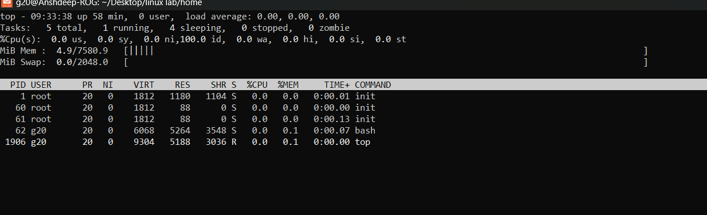

<h1>
  🚀 Experiment 09 -10 🚀
</h1>

<h3>
  01.Implement ps, top, kill command with their options.  
02. Installing, updating, and removing software by apt-get  command.
</h3>

<h1>
  Solutions: 
</h1>

<h5>
  Lab 09:
</h5>

<h6> > top : the task manager of Linux</h6>

01. Type <i>top</i> and the following screen will appear: 

02. Press <i>h</i> to see the help within top: 

03. Press  <i>u</i> to filter the process by a specific user: 

04. Press  <i>P</i> to sort the process by CPU usage:

05. Press  <i>M</i> to sort by memory usage: 

06. Press  <i>1</i> to show CPU usage for all the cores: 

07. Press  <i>k</i> to kill a process (You will be prompted for the PID):

08. Press  <i>q</i> to quit  <i>top</i>:   

<h6> > ps : used to display information about active processes</h6>

01. Type  <i>ps </i> to display the processes for the current shell: 

02. Type  <i>ps aux</i> to show all the processes on the system (with details like CPU/memory usage)

03. Type  <i>ps -ef</i> to show detailed information in a standard format: 

<h1> 🚀 Now, we are done!!  🚀</h1>